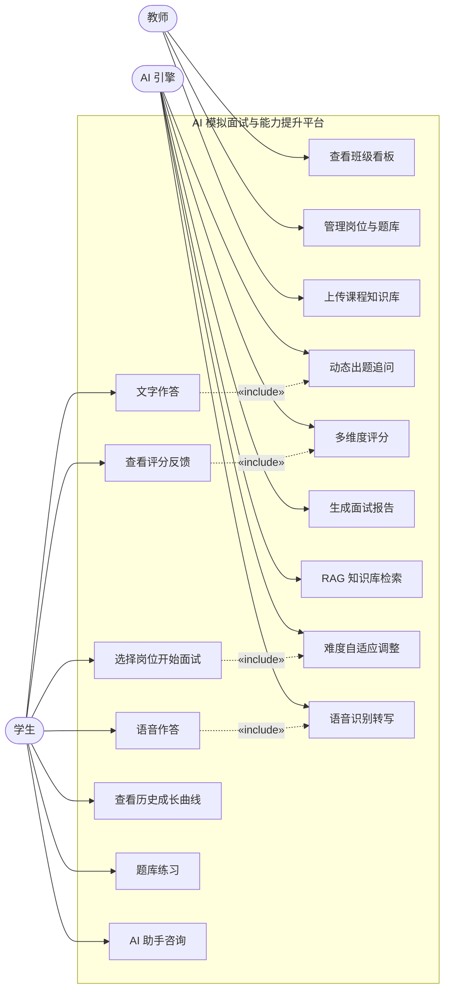
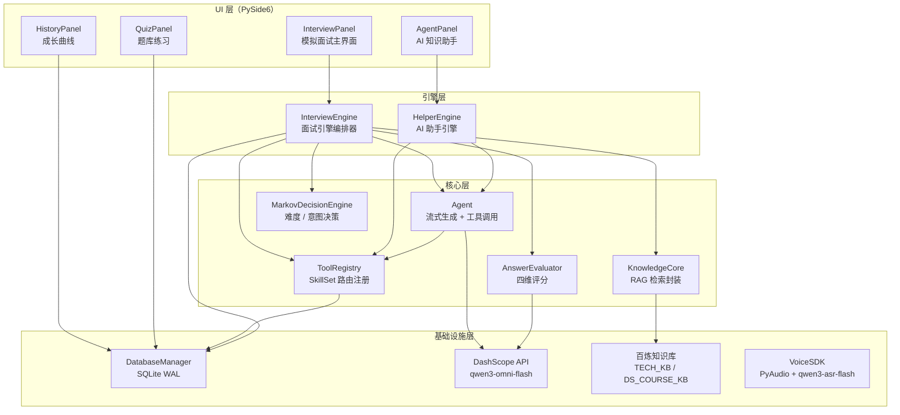
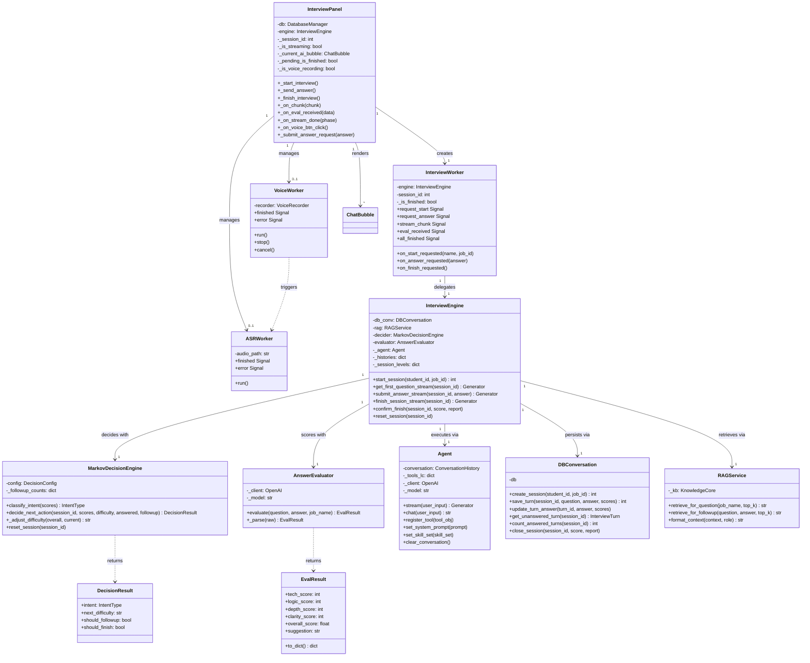

用例图

```mermaid
flowchart LR
  student(["学生"])
  teacher(["教师"])
  ai(["AI 引擎"])

  subgraph sys ["AI 模拟面试与能力提升平台"]
    uc1["选择岗位开始面试"]
    uc2["文字作答"]
    uc3["语音作答"]
    uc4["查看评分反馈"]
    uc5["查看历史成长曲线"]
    uc6["题库练习"]
    uc7["AI 助手咨询"]

    uc8["查看班级看板"]
    uc9["管理岗位与题库"]
    uc10["上传课程知识库"]

    ai1["动态出题追问"]
    ai2["多维度评分"]
    ai3["生成面试报告"]
    ai4["RAG 知识库检索"]
    ai5["难度自适应调整"]
    ai6["语音识别转写"]
  end

  student --> uc1 & uc2 & uc3 & uc4 & uc5 & uc6 & uc7
  teacher --> uc8 & uc9 & uc10
  ai --> ai1 & ai2 & ai3 & ai4 & ai5 & ai6

  uc2 -.->|«include»| ai1
  uc3 -.->|«include»| ai6
  uc4 -.->|«include»| ai2
  uc1 -.->|«include»| ai5
```
架构图

```mermaid
graph TD
  subgraph UI["UI 层（PySide6）"]
    IP["InterviewPanel\n模拟面试主界面"]
    AP["AgentPanel\nAI 知识助手"]
    HP["HistoryPanel\n成长曲线"]
    QP["QuizPanel\n题库练习"]
  end

  subgraph Engine["引擎层"]
    IE["InterviewEngine\n面试引擎编排器"]
    HE["HelperEngine\nAI 助手引擎"]
  end

  subgraph Core["核心层"]
    AG["Agent\n流式生成 + 工具调用"]
    EV["AnswerEvaluator\n四维评分"]
    MD["MarkovDecisionEngine\n难度 / 意图决策"]
    TR["ToolRegistry\nSkillSet 路由注册"]
    KC["KnowledgeCore\nRAG 检索封装"]
  end

  subgraph Infra["基础设施层"]
    DB["DatabaseManager\nSQLite WAL"]
    LLM["DashScope API\nqwen3-omni-flash"]
    KB["百炼知识库\nTECH_KB / DS_COURSE_KB"]
    VS["VoiceSDK\nPyAudio + qwen3-asr-flash"]
  end

  IP --> IE
  AP --> HE
  HP --> DB
  QP --> DB

  IE --> AG & EV & MD & TR & KC
  HE --> AG & TR

  AG --> LLM & TR
  EV --> LLM
  KC --> KB
  TR --> DB
  IE --> DB
```
学生端类图

```mermaid
classDiagram
  class InterviewPanel {
    -db: DatabaseManager
    -engine: InterviewEngine
    -_session_id: int
    -_is_streaming: bool
    -_current_ai_bubble: ChatBubble
    -_pending_is_finished: bool
    -_is_voice_recording: bool
    +_start_interview()
    +_send_answer()
    +_finish_interview()
    +_on_chunk(chunk)
    +_on_eval_received(data)
    +_on_stream_done(phase)
    +_on_voice_btn_click()
    +_submit_answer_request(answer)
  }

  class InterviewWorker {
    -engine: InterviewEngine
    -session_id: int
    -_is_finished: bool
    +request_start Signal
    +request_answer Signal
    +stream_chunk Signal
    +eval_received Signal
    +all_finished Signal
    +on_start_requested(name, job_id)
    +on_answer_requested(answer)
    +on_finish_requested()
  }

  class VoiceWorker {
    -recorder: VoiceRecorder
    +finished Signal
    +error Signal
    +run()
    +stop()
    +cancel()
  }

  class ASRWorker {
    -audio_path: str
    +finished Signal
    +error Signal
    +run()
  }

  class InterviewEngine {
    -db_conv: DBConversation
    -rag: RAGService
    -decider: MarkovDecisionEngine
    -evaluator: AnswerEvaluator
    -_agent: Agent
    -_histories: dict
    -_session_levels: dict
    +start_session(student_id, job_id) int
    +get_first_question_stream(session_id) Generator
    +submit_answer_stream(session_id, answer) Generator
    +finish_session_stream(session_id) Generator
    +confirm_finish(session_id, score, report)
    +reset_session(session_id)
  }

  class MarkovDecisionEngine {
    -config: DecisionConfig
    -_followup_counts: dict
    +classify_intent(scores) IntentType
    +decide_next_action(session_id, scores, difficulty, answered, followup) DecisionResult
    +_adjust_difficulty(overall, current) str
    +reset_session(session_id)
  }

  class AnswerEvaluator {
    -_client: OpenAI
    -_model: str
    +evaluate(question, answer, job_name) EvalResult
    +_parse(raw) EvalResult
  }

  class Agent {
    -conversation: ConversationHistory
    -_tools_lc: dict
    -_client: OpenAI
    -_model: str
    +stream(user_input) Generator
    +chat(user_input) str
    +register_tool(tool_obj)
    +set_system_prompt(prompt)
    +set_skill_set(skill_set)
    +clear_conversation()
  }

  class DBConversation {
    -db
    +create_session(student_id, job_id) int
    +save_turn(session_id, question, answer, scores) int
    +update_turn_answer(turn_id, answer, scores)
    +get_unanswered_turn(session_id) InterviewTurn
    +count_answered_turns(session_id) int
    +close_session(session_id, score, report)
  }

  class RAGService {
    -_kb: KnowledgeCore
    +retrieve_for_question(job_name, top_k) str
    +retrieve_for_followup(question, answer, top_k) str
    +format_context(context, role) str
  }

  class EvalResult {
    +tech_score: int
    +logic_score: int
    +depth_score: int
    +clarity_score: int
    +overall_score: float
    +suggestion: str
    +to_dict() dict
  }

  class DecisionResult {
    +intent: IntentType
    +next_difficulty: str
    +should_followup: bool
    +should_finish: bool
  }

  InterviewPanel "1" --> "1" InterviewWorker : creates
  InterviewPanel "1" --> "*" ChatBubble : renders
  InterviewPanel "1" --> "0..1" VoiceWorker : manages
  InterviewPanel "1" --> "0..1" ASRWorker : manages
  InterviewWorker "1" --> "1" InterviewEngine : delegates
  InterviewEngine "1" --> "1" Agent : executes via
  InterviewEngine "1" --> "1" MarkovDecisionEngine : decides with
  InterviewEngine "1" --> "1" AnswerEvaluator : scores with
  InterviewEngine "1" --> "1" DBConversation : persists via
  InterviewEngine "1" --> "1" RAGService : retrieves via
  AnswerEvaluator ..> EvalResult : returns
  MarkovDecisionEngine ..> DecisionResult : returns
  VoiceWorker ..> ASRWorker : triggers
```